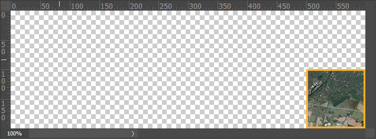

> [!NOTE]
> This extension is no longer maintained. As I am neither using XPlane nor Photoshop any longer. The extension might or might not still work. As an alternative you could try [AutoOrtho](https://github.com/kubilus1/autoortho).

# orthomagic4ps
Magic Photoshop scripts to make editing orthophotos easier. Intended as a supplement to [Ortho4XP](https://github.com/oscarpilote/Ortho4XP), as such knowing your way around it is required.

## Install
Download the latest version from the [releases](https://github.com/MorisatoK/orthomagic4ps/releases) page. Save it to a place of your liking and where you can access it from Photoshop.

## Usage
See the [wiki](https://github.com/MorisatoK/orthomagic4ps/wiki) for detailed instructions and recommendations.

## Changes
See the [changelog](./CHANGELOG.md)
